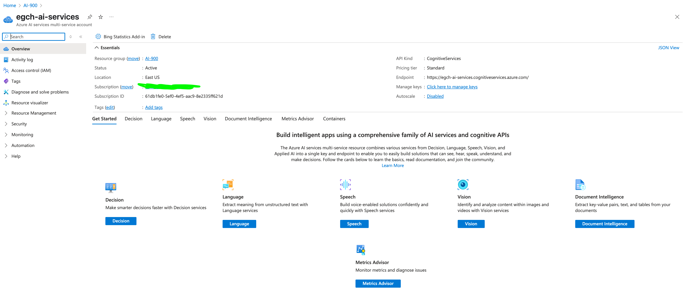

# Complementary Contents

## LLM - Large Language Model

An AI model trained on massive amounts of text data  
to understand, generate, and interact in natural language.  
Used in chatbots, search, summarization, and more.  
Examples include GPT-4 and ChatGPT.

## Generative AI
A type of artificial intelligence that creates new content  
like text, images, code, or audio based on learned patterns.  
It generates human-like outputs from prompts or data inputs.  
Examples include ChatGPT, DALL·E, and GitHub Copilot.

## 🧠 Vector-Based Embeddings

Vector-based embeddings are numerical representations of data — like words, sentences, or images — as vectors in a high-dimensional space. They capture the meaning or relationships between items so that machines can understand and compare them.

### For example

"king" → [0.7, 0.1, -0.3, ...]  
"queen" → [0.68, 0.12, -0.31, ...]

These vectors are close together, meaning the words are semantically related.

### Usage
Embeddings are used in AI tasks such as semantic search, recommendations, large language models (LLMs), and retrieval-augmented generation (RAG), enabling systems to compare meaning instead of just matching keywords.

## 🧩 Features vs Labels in Classification and Regression

In machine learning, we use **features** as inputs and try to predict the **label** as output.

| Term       | What it Means                            | Classification Example                   | Regression Example                  |
|------------|-------------------------------------------|-------------------------------------------|--------------------------------------|
| **Feature**| Input data used to make predictions       | Age, income, job type                     | Square footage, number of rooms      |
| **Label**  | The value the model is trying to predict  | Whether someone buys (Yes/No)             | House price                          |

### 🟦 Features
- The input variables for the model.
- Used to learn patterns and make predictions.
- Think of features as **questions** you ask about the data.

### 🟨 Label
- The output the model tries to predict.
- Think of the label as the **answer** you want the model to find.

### 🎯 Classification
- Label is **categorical** (e.g., Yes/No, class A/B/C).
- The model predicts **a category or class**.

### 📈 Regression
- Label is **numerical** (e.g., price, temperature).
- The model predicts a **continuous value**.

## Difference between Azure AI Speech & Azure AI Language
Azure AI Speech focuses on processing spoken language, offering features like speech-to-text, text-to-speech, and speech translation. In contrast, Azure AI Language deals with written text, providing capabilities such as sentiment analysis, entity recognition, and text summarization

## 🧠 Azure AI Foundry vs ✅ Azure OpenAI Service

### ✅ Azure OpenAI Service
- **Purpose**: Direct access to OpenAI models (like GPT-4, Codex, DALL·E) through Azure.
- **Use Case**: Integrate LLMs into apps, chatbots, automation, etc.
- **Access**: Create a **resource** in Azure and call it via REST API or SDK.
- **Control**: You manage model deployment, tokens, prompts, and API calls.
- **Best for**: Developers who want precise control and flexibility.

---

### 🧠 Azure AI Foundry
- **Purpose**: A **higher-level platform** (currently in preview) to **build, customize, and manage GenAI applications** easily.
- **Use Case**: Build GenAI apps, integrate your data, evaluate performance, manage workflows.
- **Access**: Comes with tools like **Prompt Flow**, **Model Catalog**, **Data Grounding**, and **RAG**.
- **Best for**: Teams or enterprises building complex GenAI solutions without coding everything from scratch.

---

### 🔁 Summary Table

| Feature              | Azure OpenAI Service           | Azure AI Foundry                         |
|---------------------|--------------------------------|------------------------------------------|
| **Main Focus**       | Model access & usage           | GenAI app-building platform              |
| **Control Level**    | Low-level (API-based)          | High-level (workflow & app builder)      |
| **Data Integration** | Manual                         | Built-in tools (e.g. RAG)                |
| **Target Users**     | Developers                     | Data scientists, AI teams, architects    |

## 🧠 Prompt Engineering

**Prompt engineering** is the practice of designing and refining the text prompts given to a language model (like GPT) to get the most accurate, relevant, or creative outputs.

It involves experimenting with **phrasing, structure, and context** to guide the model’s responses effectively.

## Azure AI Services
 Azure AI Services are a suite of cloud-based APIs and tools provided by Microsoft to enable developers to integrate artificial intelligence capabilities into their applications. 
 
 These services include vision, speech, language, decision, and search functionalities.
 

## Azure AI Studio(s)

Here are the main Azure AI Studios currently available:

### 1. [Azure AI Vision Studio](https://portal.vision.cognitive.azure.com/)
For building, testing, and deploying computer vision models, including:
- Object detection
- OCR
- Image analysis
- Custom models

### 2. [Azure AI Language Studio](https://language.cognitive.azure.com/)
For natural language processing tasks such as:
- Entity recognition
- Sentiment analysis
- Key phrase extraction
- Translation
- Summarization
- Custom text classification

### 3. [Azure AI Speech Studio](https://speech.microsoft.com/)
For speech-related AI tasks, including:
- Speech-to-text
- Text-to-speech
- Custom voice models
- Speech translation

### 4. [Azure AI Search Studio](https://portal.azure.com/#view/Microsoft_Azure_Search/SearchExtensionBlade)
For building and managing search experiences powered by AI:
- Full-text search
- Semantic search
- Cognitive search with AI enrichment

### 5. [Azure AI Studio](https://ai.azure.com/)
A unified studio for:
- Prompt engineering
- Retrieval-Augmented Generation (RAG)
- Copilot development
- Integration with other Azure AI services

### 6. [Azure Machine Learning Studio](https://ml.azure.com/)
For data science and ML engineering:
- Training and deploying ML models
- MLOps pipelines
- Experiment tracking
- Model registry
- Notebooks and AutoML

### 7. [Azure Document Intelligence Studio](https://documentintelligence.ai.azure.com/studio/)

---

**Note:**  
Microsoft is consolidating many GenAI and applied AI tools into **Azure AI Studio**. However, **Azure Machine Learning Studio** remains distinct for traditional ML workflows and deeper MLOps requirements.

---
[Home](README.md)