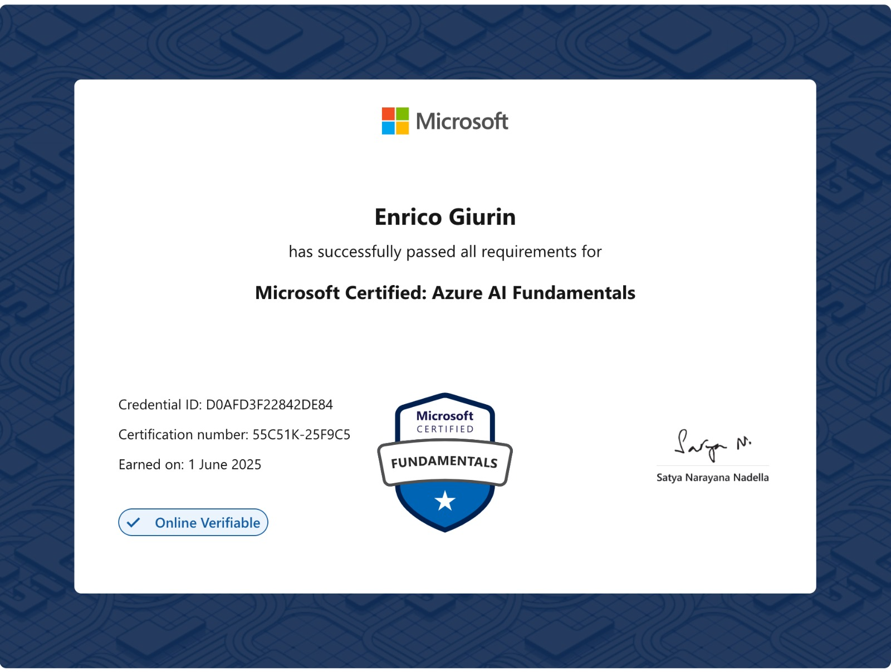

# azure-AI-900-preparation
This repository captures my journey studying for the Microsoft Azure AI Fundamentals (AI-900) exam. It includes my personal notes, practice questions, and hands-on exercises to reinforce key AI concepts and help others prepare effectively.

## Credentials

[MS Credentials](https://learn.microsoft.com/en-gb/users/enricogiurin-7522/credentials/d0afd3f22842de84?ref=https%3A%2F%2Fwww.linkedin.com%2F)

## Chapters
- [Section 1](main/section1.md)
- [Section 2](main/section2.md)
- [Section 3](main/section3.md)
- [Section 4](main/section4.md)
- [Section 5](main/section5.md)
- [Section 6](main/section6.md)

## Complementary Contents
- [Complementary Contents](ComplementaryContents.md)
- [Azure AI Search](ai-search.md)

## Exam Preparation
- [Topics to review](exam-preparation/review.md)
- [Doubts](exam-preparation/doubts.md)
- [Machine Learning Q&A](exam-preparation/machine-learning-clarified.md)
- [Computer Vision Q&A](exam-preparation/computer-vision-clarified.md)
- [AI workloads](exam-preparation/ai-workloads-clarified.md)
- [Conversational AI](exam-preparation/conversational-AI-clarified.md)
- [NLP](exam-preparation/NLP-clarified.md)

### Tests
[Test Activity](exam-preparation/test-activity.md)

## Acknowledgements
This project includes content generated with the help of ChatGPT by OpenAI.

## Resources
- [Udemy Course by A. Rodrigues](https://www.udemy.com/course/microsoft-azure-beginners-guide/)
- [ML Algorithms](https://azure.microsoft.com/en-us/resources/cloud-computing-dictionary/what-are-machine-learning-algorithms)
- https://learn.microsoft.com/en-us/azure/machine-learning/component-reference/evaluate-model?view=azureml-api-2
- https://learn.microsoft.com/en-us/rest/api/computervision/operation-groups?view=rest-computervision-v3.2
- [MS Official Learning Modules](https://learn.microsoft.com/en-us/credentials/certifications/azure-ai-fundamentals/?practice-assessment-type=certification)

### Questions
- [Azure AI-900 Fundamentals Practice Questions](https://github.com/IsabellaS2/AI-900)

- [Microsoft AI-900 Questions](https://www.youtube.com/redirect?event=video_description&redir_token=QUFFLUhqa0w5dXV0emJCV3J1YXVoelR3YUUtUnBLcmJYd3xBQ3Jtc0tsekNHZUx2Vk96SWs4cjNnWWhwRnAwM0NTbEMzeDN5OElwVzFmUHFPSkNDckhUVlFwTy1uN0pnOGJsZ1lYMXQ3cjhmalNTZ2g5aDd2dTFSTTVGeUQ0R0xjZlVJSVV4VnhKaWpJQXM1Unc0eEVTLWNKTQ&q=https%3A%2F%2Flearn.microsoft.com%2Fen-us%2Fcredentials%2Fcertifications%2Fazure-ai-fundamentals%2Fpractice%2Fassessment%3Fassessment-type%3Dpractice%26assessmentId%3D26%26practice-assessment-type%3Dcertification&v=KF8B_wZzmes)