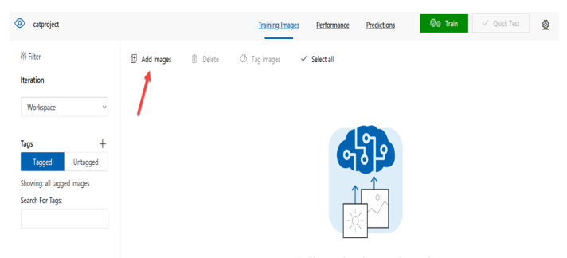

# Describe features of computer vision workloads on Azure 
##  Grayscale image
Q. What does a single layer of pixel values in an image represent?  

A. Grayscale image

### ✅ Explanation:

A **single layer of pixel values** means each pixel is represented by **one value**, indicating its **intensity** — from black (0) to white (255).

This forms a **grayscale image**, which does **not contain color**, only varying shades of gray.

#### 🧠 Key point:
Grayscale images are often used in computer vision tasks to **simplify processing** and **reduce computation**.

---

## Convolutional Neural Networks (CNNs)

Q. Which machine learning model architecture is commonly used in computer vision for image classification?

A. Convolutional Neural Networks (CNNs)

### ✅ Explanation:

**Convolutional Neural Networks (CNNs)** are a specialized type of neural network designed for **processing image data**.

They use **convolutional layers** to automatically detect features like edges, shapes, and textures, making them ideal for **image classification** tasks.

#### 🧠 Key point:
CNNs are highly effective in recognizing spatial hierarchies in images, and they form the backbone of most modern **computer vision** applications.

---

## Azure AI Vision's Read API
Q. What is the purpose of Azure AI Vision's Read API?

A. Extract machine-readable text from images, PDFs, and TIFF files

### ✅ Explanation:

The **Azure AI Vision Read API** is designed to **analyze images and documents** to extract **printed and handwritten text** in a machine-readable format.

It supports formats like:
- **Images** (JPEG, PNG, etc.)
- **PDF files**
- **TIFF files**

#### 🧠 Key point:
The Read API enables **optical character recognition (OCR)**, which is essential for digitizing documents and automating text extraction from visual content.

---

## Which artificial intelligence (AI) technique serves as the foundation for modern image classification solutions?
Deep learning

### Explanation

Modern image classification is primarily powered by **deep learning**, especially **convolutional neural networks (CNNs)**. These models automatically learn to extract features from images, enabling high accuracy in tasks like object detection, face recognition, and image tagging.

---

## Which two specialized domain models are supported by Azure AI Vision?
Celebrities and Landmarks

Azure AI Vision includes built-in models to recognize:
- **Celebrities**
- **Landmarks**

---
## Semantic Segmentation

**Semantic segmentation** is a type of image analysis in computer vision where each pixel in an image is classified into a specific category or class.

### 🔍 What It Does
It **labels each pixel** in the image with a class (e.g., sky, road, car, person). The result is a **segmented image** where regions belonging to the same object class are marked with the same label.

### 📷 Example
Imagine an image of a street with people and cars:
- All pixels belonging to cars → labeled `"car"`
- All pixels of the road → labeled `"road"`
- All pixels of people → labeled `"person"`

### 🧠 Use Cases
- 🚗 Self-driving cars (understanding road scenes)
- 🏥 Medical imaging (identifying organs or tumors)
- 🛰️ Satellite imagery analysis
-  Augmented reality

 [MS](https://learn.microsoft.com/training/modules/get-started-ai-fundamentals/4-understand-computer-vision)

---
## Azure AI Vision Workload Features

**Q. Which two artificial intelligence (AI) workload features are part of the Azure AI Vision service?**  
**A. Optical Character Recognition (OCR) / Spatial Analysis**  
[Source: Microsoft Learn](https://learn.microsoft.com/training/paths/explore-computer-vision-microsoft-azure/)

The Azure AI Vision service includes powerful features such as:

- **Optical Character Recognition (OCR)**: Automatically detects and extracts printed or handwritten text from images and documents.
- **Spatial Analysis**: Interprets movement patterns and people presence in physical spaces using video feeds, useful for foot traffic analysis and safety monitoring.

## Custom Vision service
Q. You are planning on using the Custom Vision service. Do you need to provide your own images to train the model in Custom Vision? (Udemy)
A. Yes - Yes, when you create a project in the Custom Vision service, you have to upload your own images to train the model.

## Custom Vision service - faces
Q. Your team is planning on using the Computer Vision service. Can you use the service to detect faces from images?

A. Yes - Yes , this is possible with the Computer Vision service.

For more information on the Computer Vision service, one can visit this [link](https://docs.microsoft.com/en-us/azure/cognitive-services/computer-vision/overview).

## Object Detector

Q. Your team is planning on using the Custom Vision service. They are going to build an object detector. Do you need to specify a domain when building the object detector?

A. Yes ✅

### Explanation:
When using **Azure Custom Vision** to build an **object detector**, you **must specify a domain**.

- Azure Custom Vision offers multiple domains optimized for different tasks (e.g., General, Retail, Landmarks).
- For object detection, you need to select the **"Object Detection"** domain during project creation.
- This ensures the model is trained with the appropriate architecture and capabilities to detect and localize multiple objects within images.

For more information on the Custom Vision Service – Object detector, one can visit the below URL:

https://docs.microsoft.com/en-us/azure/cognitive-services/custom-vision-service/get-started-build-detector

## Computer Vision: Face API Attributes

**Q. Can you use the Face API to return face attributes such as headPose and occlusion?**  
**A. Yes**  
[Source: Microsoft Learn](https://learn.microsoft.com/azure/cognitive-services/face/face-api-how-to-topics/howtoanalyzefacesinimage)

Azure **Face API** can analyze faces in an image and return detailed **facial attributes**, including:

- **headPose** – direction the face is pointing (pitch, roll, yaw)
- **occlusion** – whether facial features are covered (e.g., by glasses, hands)
- As well as other features like age, gender, emotion, and facial landmarks.

This is useful in applications like identity verification, emotion tracking, and facial analytics.

## Computer Vision: Face Matching with Azure Face API

**Q. When using the Azure AI Face service, what should you use to perform one-to-many or one-to-one face matching?**  
**A. Face Identification / Face Verification**  
[Source: Microsoft Learn](https://learn.microsoft.com/training/modules/detect-analyze-faces/)

Azure **Face API** supports two main face matching operations:

- **Face Identification**:  
  Performs **one-to-many** matching by comparing a detected face against a group of known faces to find the best match.

- **Face Verification**:  
  Performs **one-to-one** comparison to check if two faces belong to the same person.

These features are useful for security, access control, and identity verification applications.

## Computer Vision: Image Description Confidence Score

**Q. Which additional piece of information is included with each phrase returned by an image description task of the Azure AI Vision?**  
**A. Confidence score**  
[Source: Microsoft Learn](https://learn.microsoft.com/training/modules/analyze-images-computer-vision/2-image-analysis-azure)

When Azure AI Vision generates **image descriptions**, each phrase is accompanied by a **confidence score** — a numerical value between 0 and 1 indicating how likely the model believes the description is correct.

Example:
> Description: "A group of people standing on a beach"  
> Confidence score: **0.89**

This helps users assess the **reliability** of the AI-generated content.

