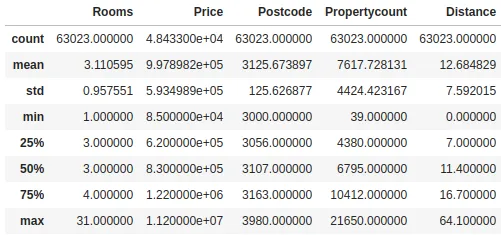
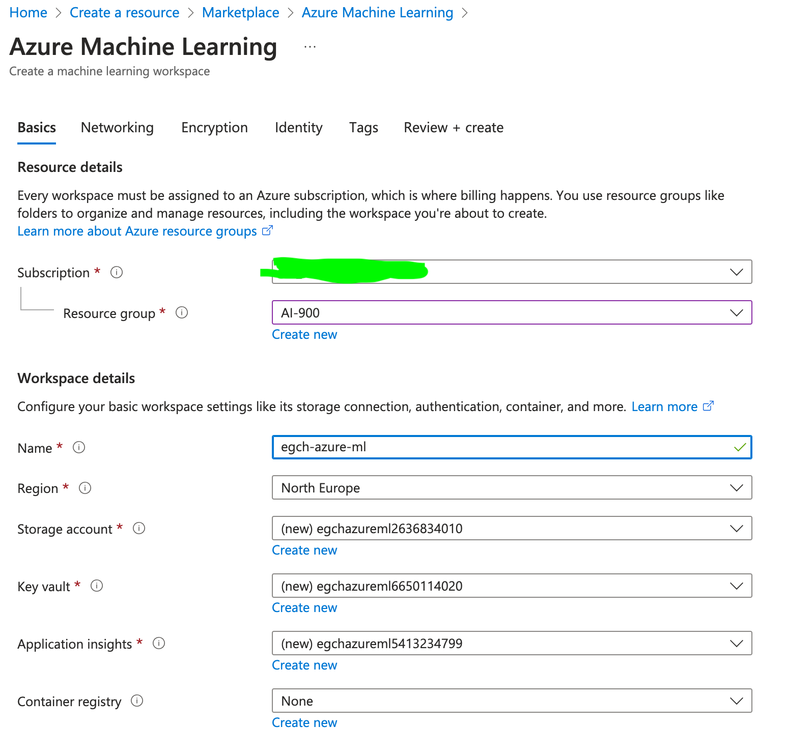
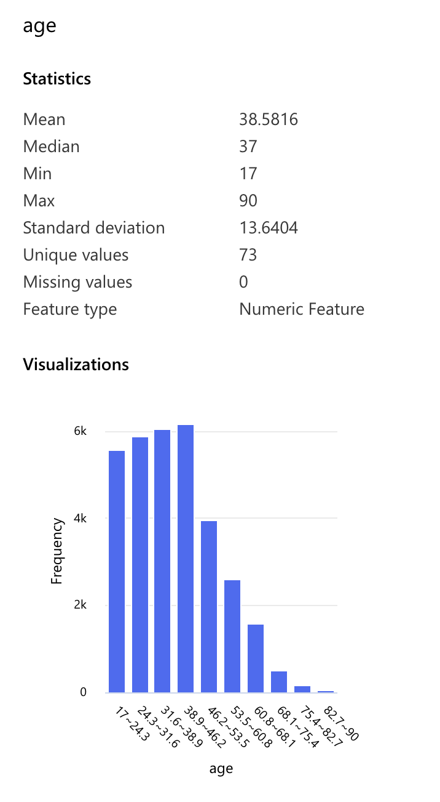
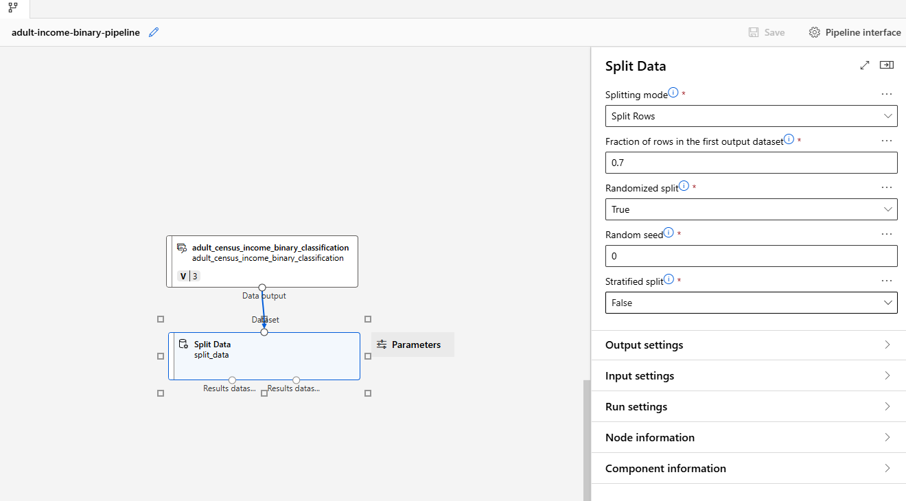
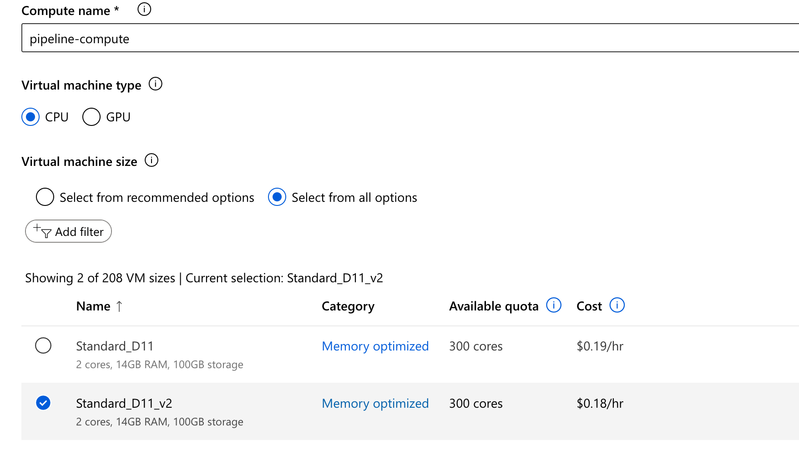
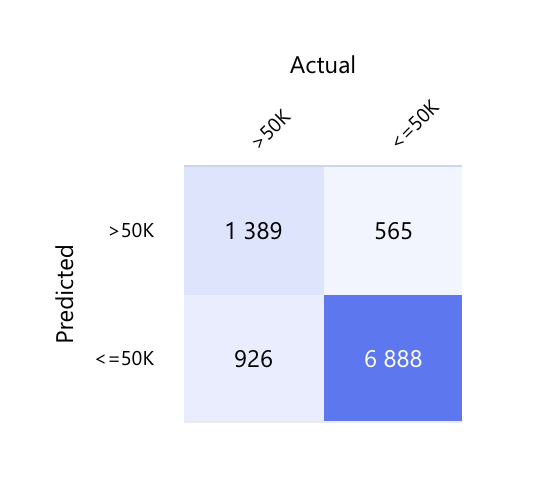
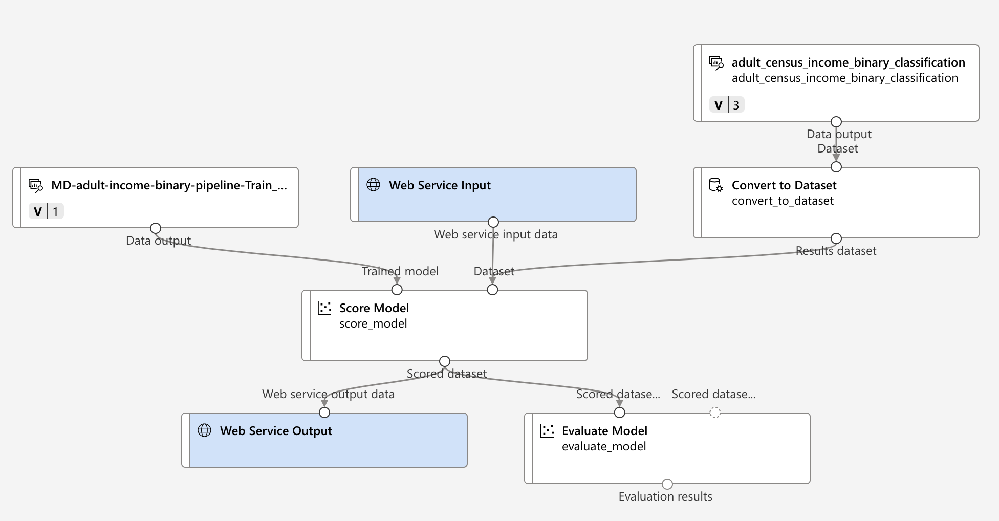

# section 3 - Describe fundamental principles of machine learning on Azure
## Use Cases
- Detecting fraudulent transactions;
- Recognizing objects (vision);
- Medicine

## ML - Machine Learning
1. Training data to train the model
2. Which algorithm needs to be used
3. Once model has been trained you can test/validate the model with some test data.

### Partitions
- Training data - 70%
- Test Data - 30%
### Data Set
- should be relevant to the problem being solved
- There should be enough data
- The data should be free of errors

Not all the transactions or the columns are needed to train your data model.
- Clean the data
- Filter the data.
#### Example - Prediction price of Houses
  

## Algorithms
- Classification Algorithms
- Linear Regression Algorithms
- Regression Algorithms
- Anomaly Detection Algorithms
- Time Series Algorithms
- Clustering Algorithms

### Classification Algorithms
> Multiclass classification is a type of machine learning task where the goal is to classify input data into one of three or more classes. Each data point is assigned to only one class from a set of multiple possible categories.

For example, classifying emails as spam, social, or promotions is a multiclass classification task.

There are two main types of classification problems:

- Binary classification – only two classes (e.g., spam vs. not spam).

- Multiclass classification – more than two possible classes (e.g., classifying animals as cat, dog, bird).

[Machine learning algorithms](https://azure.microsoft.com/en-us/resources/cloud-computing-dictionary/what-are-machine-learning-algorithms)

### 📚 Clustering in Machine Learning 

**Clustering** is an **unsupervised learning** technique in machine learning where the goal is to group similar data points into **clusters**, without using labeled data.

Each cluster contains data points that are more similar to each other than to those in other clusters.

---

#### 🔍 Key points:
- **Unsupervised**: No predefined labels or categories.
- **Goal**: Discover hidden patterns or natural groupings.
- **Examples**:
  - Customer segmentation
  - Document/topic grouping
  - Image compression

### Learning Types
- Supervised Learning - Task Driven (Predict next value)
- Unsupervised Learning - Data Driven (Identify Clusters)
- Reinforcement Learning - Learn from mistakes

## Azure ML
Azure ML Studio
### Lab - Creating a workspace
- marketplace
- Azure Machine Learning
- Create

#### Elements
- storage account - to store the log of your job
- Azure Container Registry - for docker containers
- Azure Application Insights - diagnostic information
- Key Vaults - to store secrets

### Launch Studio

## Azure ML Studio
### Build a Classification Machine Learning Pipeline
Pipeline: A ML pipeline is a workflow that is used to execute a ML task.

## Adult Census income Binary Classification
We want to predict if the Income is greater or lower than 50K.
- Designer
- Create new Pipeline
  
### Sample Data: Adult Census Income Binary Classification dataset

### Split Data
- Pipeline Interface
- click Split Data

    
    
- We set 70% (30% test data)

### Computer Instance
 - Compute
 - Standard_D11_v2
  

### Set Pipeline Job/experiment
TBD
### Train the model
TBD
### Two-Class Logistic Regression
TBD
### Score Model
TBD
### Evaluate Model

### Final Pipeline

### Submit the Job

### Evaluate Model Preview Data - Confusion Matrix
Wth the 30% of the test data we do not use use income column 

- TP - True Positive (Predict >  50K, Actual > 50K)
- FP - False Positive (Predict >  50K, Actual <= 50K)
- TN - True Negative (Predict <= 50K, Actual <= 50K)
- FN - False Negative (Predict <= 50K, Actual > 50K)

Accuracy = (TP+TN) / (TP+TN+FP+FN)
​

### Trying with another algorithm
Replacing _Two-Class Logistic Regression_ algorithm with _Two-Class Boosted Decision Tree_

Then submit the job and comparing the results.
With this new algorithm the accuracy is better than before.

### Pipeline deployment
- Jobs
- select a Job
- Create Inference Pipeline
- Real Time Inference Pipeline
  

- create Kubernetes cluster (AksCompute)

### Endpoints

## Regression Model
automobiles-pipeline

automobile_price_raw

The column normalized-losses has 41 missing values.

We need to clean our data by selecting ony columns with consistent data. 

- Automobile price row
- Clean Missing data 1, 2
- Split Data (70% - 30%)
- Train Model
- Linear Regression (algorithm)
- Score Model

### Final Pipeline

### Submit pipeline job

## Using your own dataset
- ML Workspace
- Data
- Data Asset / Create
- Upload file from Udemy course. [EventdataTraining](csv/EventdataTraining.csv)
- Automated ML / new Automated ML job
- Select task type: Classification
- Target column*: SecurityEvent
- Select compute type: Serverless
- Submit Training job
- We cancel the job after 25' (approximately)
- It evaluates different algorithms.

## Summary
- Regression
- Binary Classification
- Clustering
- Features (training data)
- Accuracy
- Precision
- Recall
- F1Score
- AUC
- Mean absolute error
- Root mean squared error
- relative absolute error
- relative square error
- coefficient of determination
- pipeline
- Inference or batch pipeline
- Automated ML
## References
[How To Use ML To Solve House Price Prediction Problem](https://medium.com/@vivekpadia70/understanding-how-airbnb-uses-machine-learning-to-solve-house-price-prediction-problem-afd5c6c9ec32)

---
[Home](../README.md)