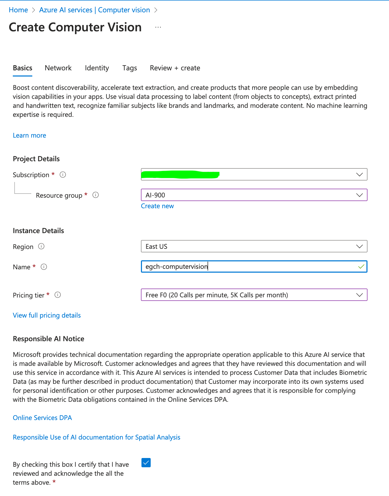
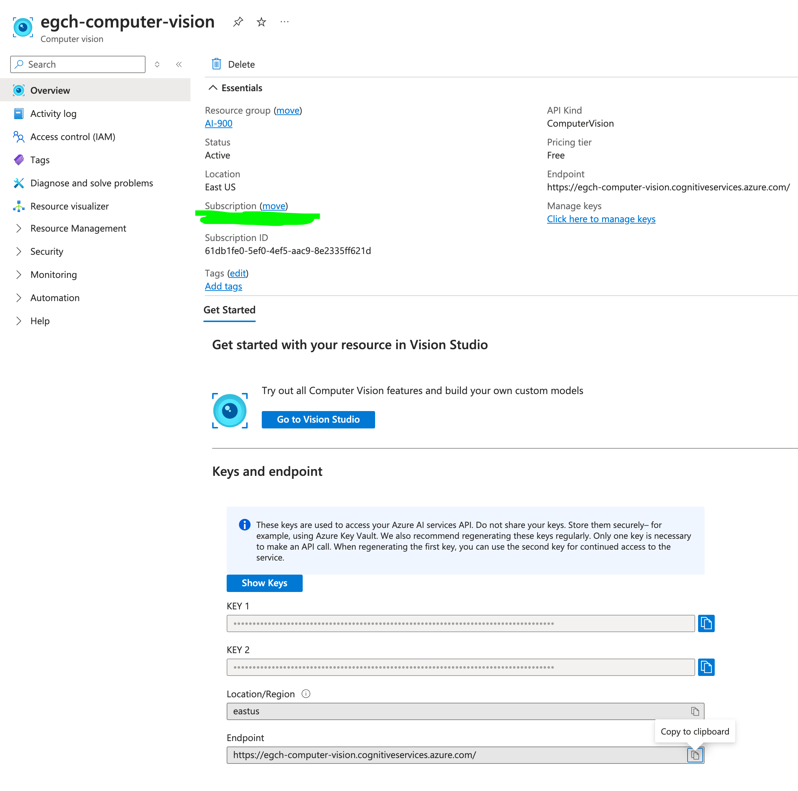
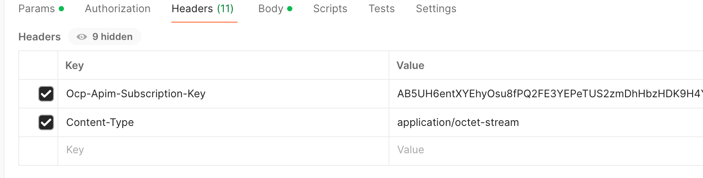
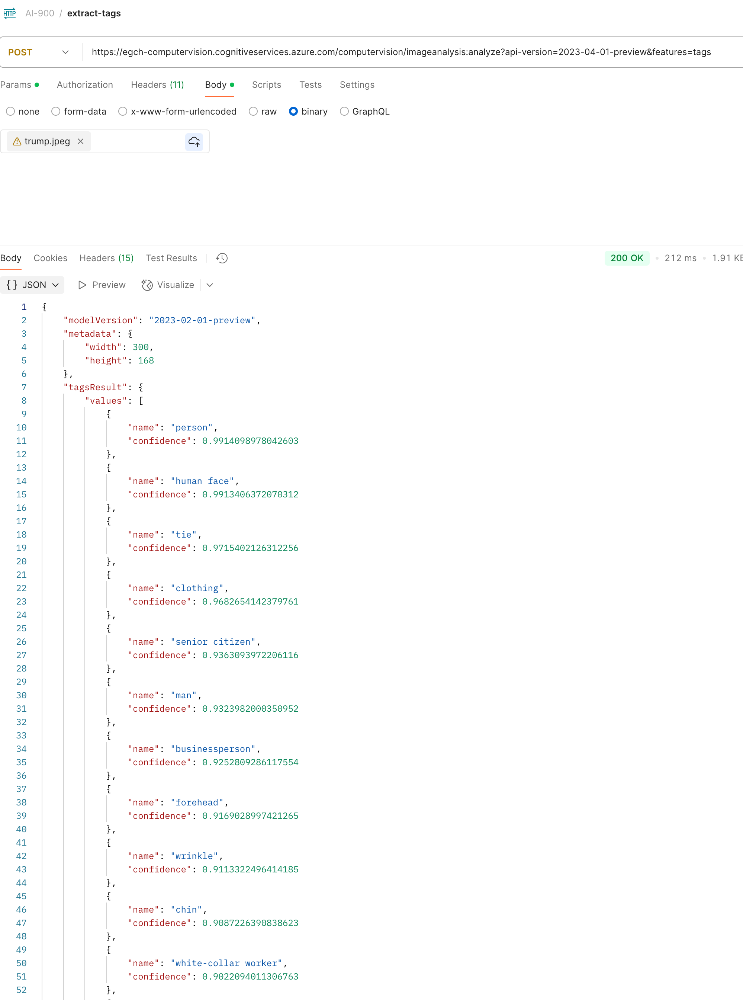
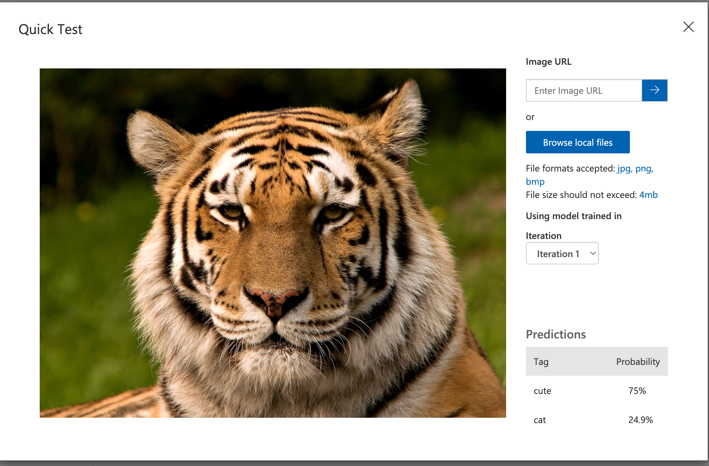

# section 4 - Describe features of computer vision workloads on Azure
Azure Computer Vision

## ComputerVision
> Azure Computer Vision is service that uses AI to analyze images and videos, allowing you to extract information like objects, text, faces, and scene descriptions.

It helps developers build apps that can "see" and understand visual content.
From Marketplace create Computer Vision resource.

The service formerly known as Azure Computer Vision has been renamed to **Azure AI Vision**. 

### Create Computer Vision
    

The click on **Go to Vision Studio**.   
Alternative we can use _Azure AI Foundry_.

Behind the scenes, Visual Studio calls the Azure AI Vision service.

### Extract common tags from images
Image Analysis / Extract common tags from images

For each tag it provides a confidence code (0-100%).

We can also see the json contents.

### Add captions to images
Image Analysis / Add captions to images

### Object Detection
Image Analysis / Detect common objects in images

Note the bounded rectangle on the images.

#### Json

### Extract text from images
Optical character recognition / Extract text from images.

## API Vision Service

[docs](https://learn.microsoft.com/en-us/rest/api/computervision/image-analysis/analyze-image?view=rest-computervision-v4.0-preview%20(2023-04-01)&tabs=HTTP)

### Analyze Image

### POST
URL: https://egch-vision.cognitiveservices.azure.com/computervision/imageanalysis:analyze?api-version=2023-04-01-preview&features=tags

In the Body, change the type to binary, then upload a file.

#### Headers
- **Ocp-Apim-Subscription-Key**: corresponding to the key of `computervision` in Azure
- **Content-Type**: application/octet-stream

### Response

## Custom Vision
**Azure Custom Vision** is a service that lets you build, deploy, and improve custom image classifiers. It allows users to train models with their own images and tags for specific object recognition tasks.

MarketPlace / custom vision / Create

[custom vision portal](https://www.customvision.ai/)

### Project Cats recognition
From custom vision portal, once authenticated, create a new project.

- add 10 images with tags (cute, cat)
- train
- quick training

   
Then click on publish.

Quick test (tiger)

## Azure AI Face service

[What is Azure Face Service](https://learn.microsoft.com/en-us/azure/ai-services/computer-vision/overview-identity)

### Face recognition operations
- Identification – Determine who a person is by comparing their face against a known database. Face identification can address "one-to-many" matching of one face in an image to a set of faces in a secure repository.

- Verification – Confirm if two face images belong to the same person. The verification operation answers the question, "Do these two faces belong to the same person?".

- Find Similar Faces – Retrieve faces from a collection that closely resemble a given input face. he Find Similar operation does face matching between a target face and a set of candidate faces, finding a smaller set of faces that look similar to the target face. This is useful for doing a face search by image.

- Group Faces – Automatically cluster faces that appear to belong to the same person or share strong visual similarities. The Group operation divides a set of unknown faces into several smaller groups based on similarity. 

### Create Face
- Marketplace create Face
- Vision Studio / Face / Detect faces in an image
- [Vision Studio](https://portal.vision.cognitive.azure.com/gallery/featured)

### Face detection via postman
POST URL: https://learn.microsoft.com/en-us/rest/api/face/face-detection-operations/detect?view=rest-face-v1.2-preview.1&tabs=HTTP

## Document Intelligence
> Azure AI Document Intelligence is a cloud-based service that uses machine learning and OCR to extract structured data—such as text, tables, and key-value pairs—from various documents like invoices, receipts, and contracts. It offers both prebuilt and customizable models to automate document processing workflows. 

Marketplace / Search 'Document Intelligence' / Document Intelligence (form recognizer) / Create   

[Document Intelligence Studio](https://documentintelligence.ai.azure.com/studio/)
### Invoices
Document Intelligence Studio / Invoices

## Azure AI Foundry
[Azure AI Foundry docs](https://learn.microsoft.com/en-us/azure/ai-studio/what-is-ai-studio)

So whatever we are done using the different user interfaces early on, such as Vision Studio, the Document Intelligence Studio, we can do everything from Azure AI Foundry itself.

### Create a Project

- MarketPlace / Azure AI Foundry / Create

- Launch Azure AI Foundry

- Create Project

### Project - Common image detection
From the project:

AI Services / Vision + Document / Image / Common image detection

From here we have the same interfaces seen with Visual Studio.

  
### Project - Invoices
AI Services / Vision + Document / Document / Invoices
## Links
[Azure Portal Vision Cognitive](https://portal.vision.cognitive.azure.com/gallery/featured)

[What is Azure AI Vision?](https://learn.microsoft.com/en-us/azure/ai-services/computer-vision/overview)

[Azure AI Vision - Training Module](https://learn.microsoft.com/en-gb/training/modules/analyze-images-computer-vision/3-image-analysis-azure)

---
[Home](../README.md)