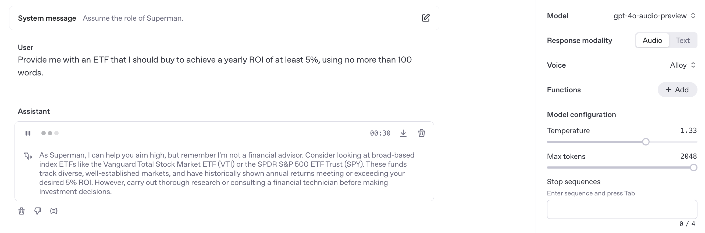
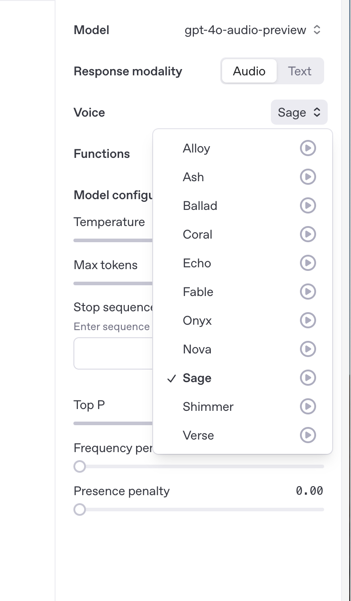
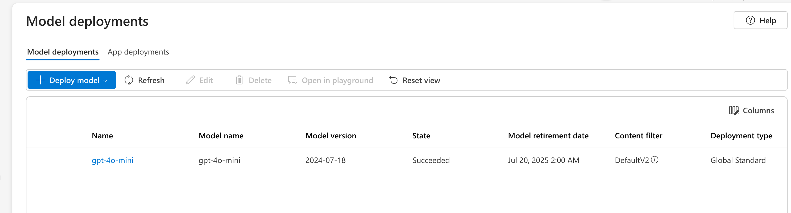
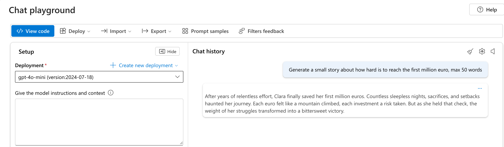
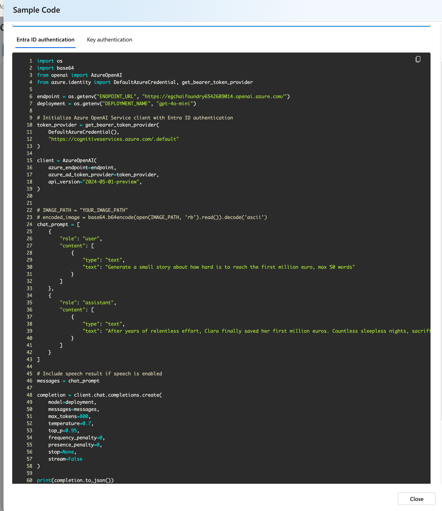
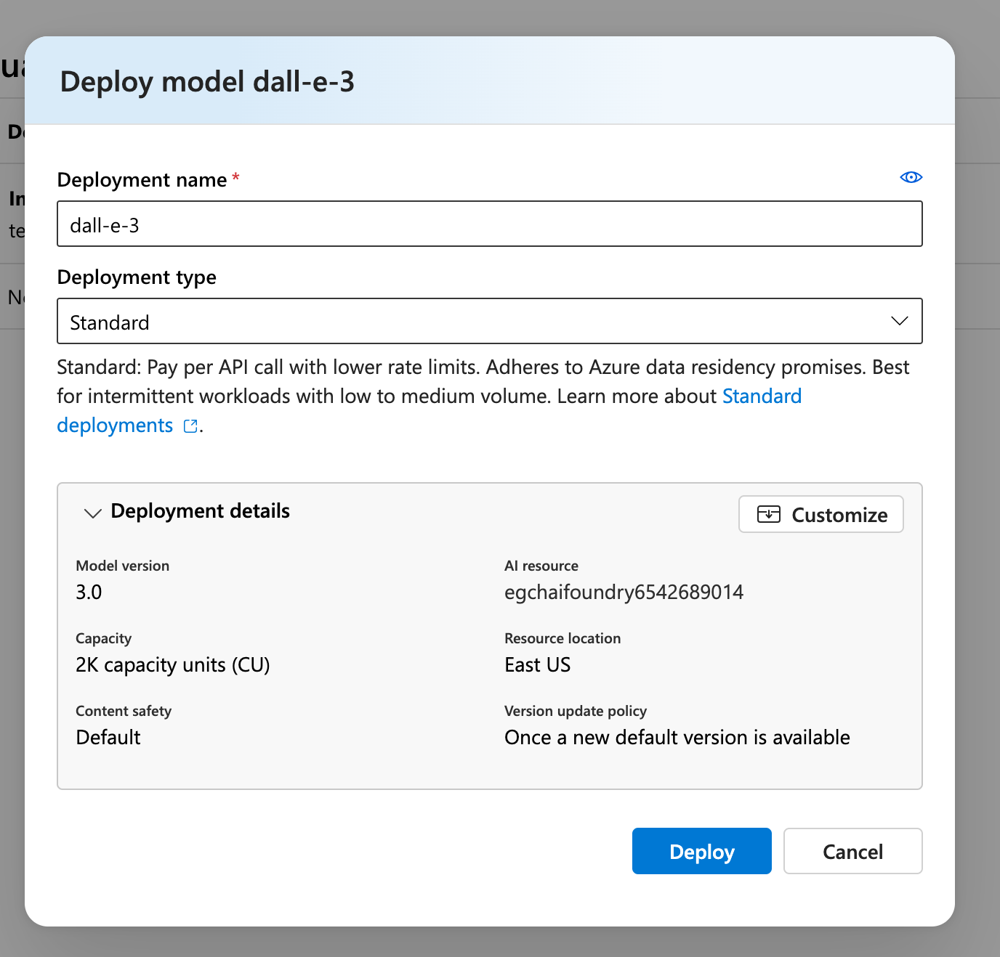
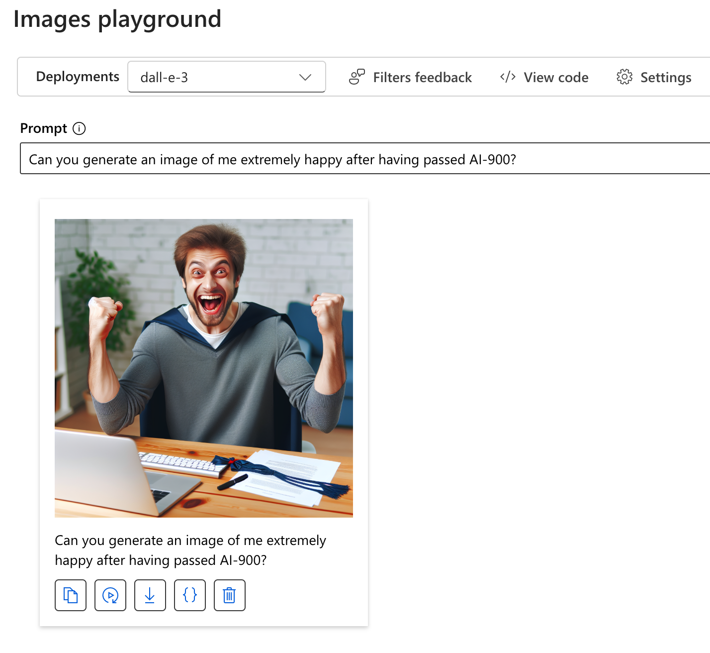

# section 6 - Generative AI workloads for Azure
## Large Language Models - LLM

A type of artificial intelligence trained on massive amounts of text to understand and generate human-like language.
### Chat GPT
GPT - Generative pre-trained transformer.

ChatGPT is a generative AI chatbot developed by OpenAI. Currently based on GPT-4 language model.
### Github Copilot
- github account
- github copilot: Let's use the free version.
- Download vs code
- Extensions / GitHub Copilot

## OpenAI Platform

- [OpenAI Developer Platform](https://platform.openai.com/docs/overview): Official documentation to explore and integrate OpenAI models via API.
- [OpenAI Studio](https://platform.openai.com): A web-based interface to interact with and customize models like GPT, build assistants, experiment with prompts, and manage deployments — no code required.

- Buy some credit
- Generate API Keys

### Signup
### Tokens
[Tokenizer](https://platform.openai.com/tokenizer)

When it's down to costs you need to consider the total number of tokens both input and output.

#### Parameters
_Max tokens_

_Temperature_

## GPT - System Messages

## GPT - Using the audio feature

<audio controls>
  <source src="audio/chat-playground-audio.wav" type="audio/wav">
  Your browser does not support the audio element.
</audio>

## Azure OpenAI service
Create Azure AI Foundry from the Azure marketplace.

[OpenAI prices](https://azure.microsoft.com/en-us/pricing/details/cognitive-services/openai-service/)

[Azure OpenAI service](https://learn.microsoft.com/en-us/azure/ai-services/)

1. MarketPlace: Create Azure AI Foundry  
2. ai-services (Azure AI Services)  
3. Go to Azure AI Foundry portal  
4. Model Catalog  
5. gpt-4o-mini  
6. Create Project (not clear why it creates new resources)  
7. Deploy  
8. Open in playground

Chat Playground

View Code

Or in Java [here](code/s6/story-generated.java).

### Image Generation
1. Navigate to the **Model Catalog**.
2. Select **DALL-E 3** from the available models.
3. Click on **Deploy** to set up the model for use.

Generate Image

---
[Home](../README.md)