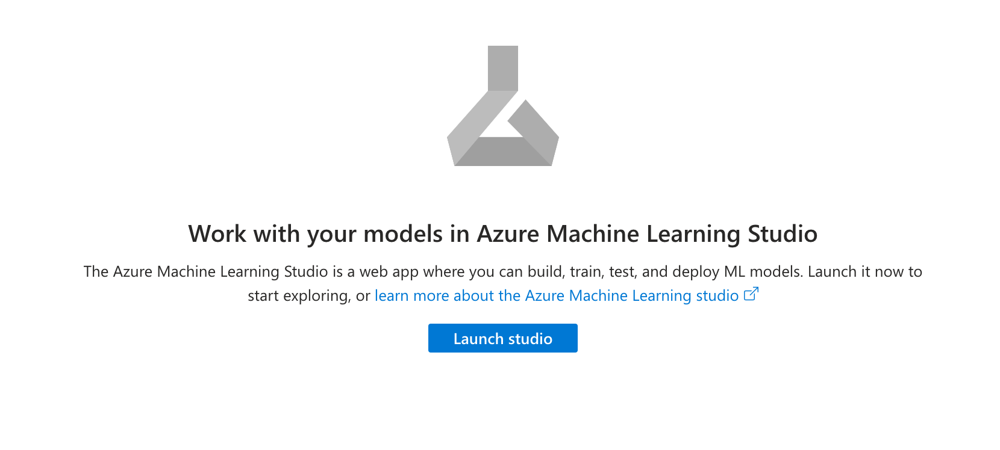
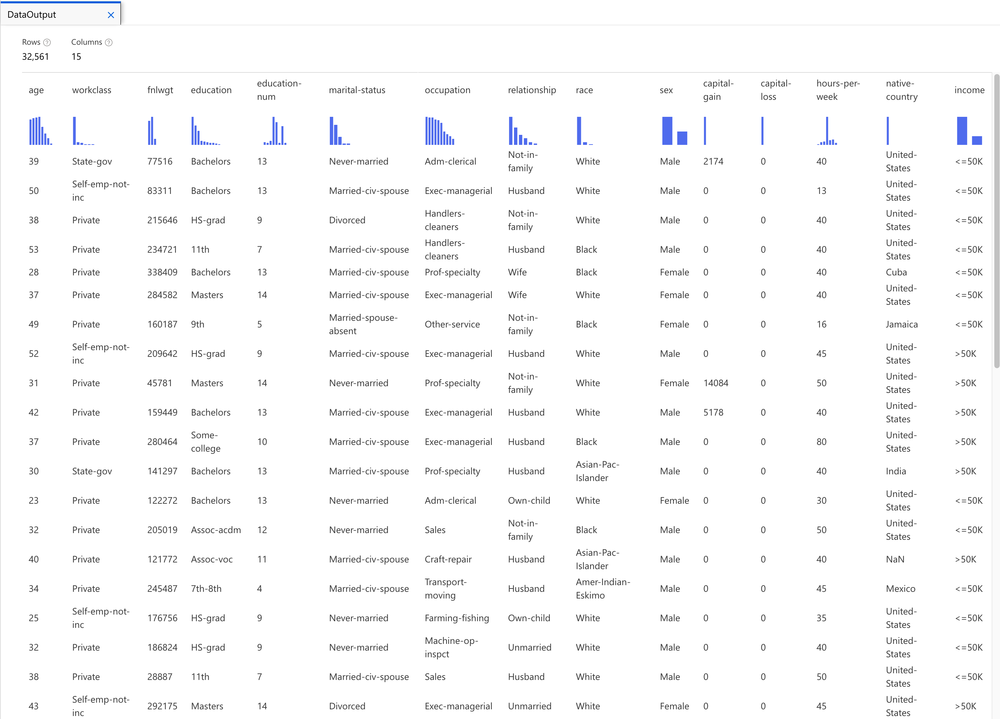
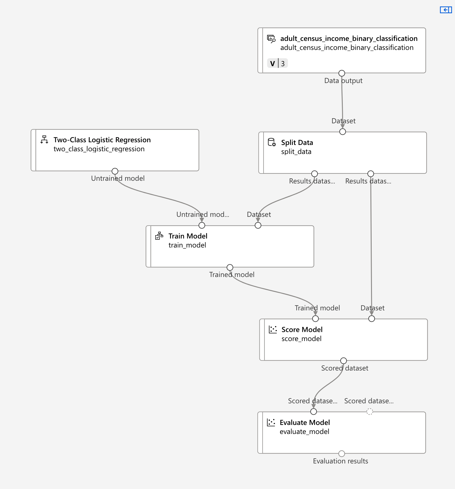
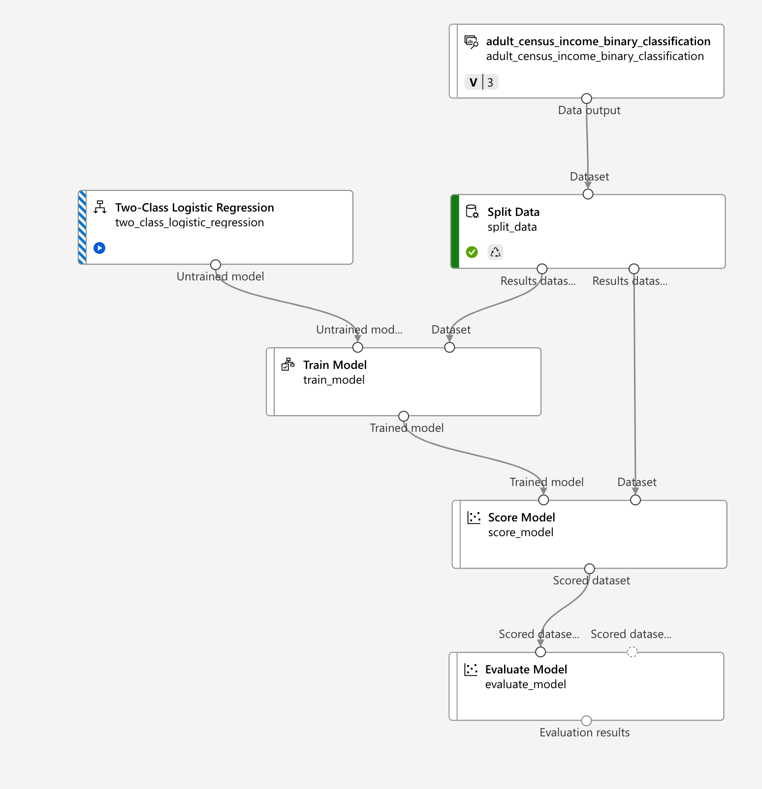
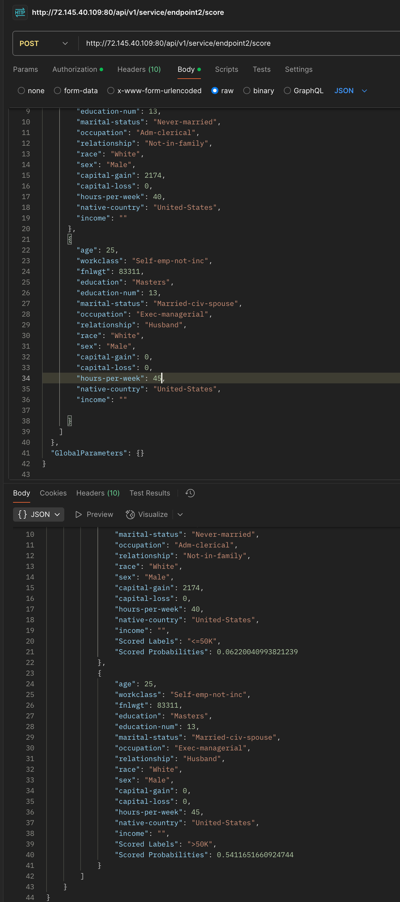

# section 3 - Describe fundamental principles of machine learning on Azure
## Use Cases
- Detecting fraudulent transactions;
- Recognizing objects (vision);
- Medicine

## ML - Machine Learning
1. Training data to train the model
2. Which algorithm needs to be used
3. Once model has been trained you can test/validate the model with some test data.

### Partitions
- Training data - 70%
- Test Data - 30%
### Data Set
- should be relevant to the problem being solved
- There should be enough data
- The data should be free of errors

Not all the transactions or the columns are needed to train your data model.
- Clean the data
- Filter the data.
#### Example - Prediction price of Houses
  

## Algorithms
- Classification Algorithms
- Linear Regression Algorithms
- Regression Algorithms
- Anomaly Detection Algorithms
- Time Series Algorithms
- Clustering Algorithms
  

[Machine learning algorithms](https://azure.microsoft.com/en-us/resources/cloud-computing-dictionary/what-are-machine-learning-algorithms)

### Learning Types
- Supervised Learning - Task Driven (Predict next value)
- Unsupervised Learning - Data Driven (Identify Clusters)
- Reinforcement Learning - Learn from mistakes

## Azure ML
Azure ML Studio
### Lab - Creating a workspace
- marketplace
- Azure Machine Learning
- Create

#### Elements
- storage account - to store the log of your job
- Azure Container Registry - for docker containers
- Azure Application Insights - diagnostic information
- Key Vaults - to store secrets

### Launch Studio

## Azure ML Studio
### Build a Classification Machine Learning Pipeline
Pipeline: A ML pipeline is a workflow that is used to execute a ML task.

## Adult Census income Binary Classification
We want to predict if the Income is greater or lower than 50K.
- Designer
- Create new Pipeline
- Sample Data: Adult Census Income Binary Classification dataset

### Split Data
- Pipeline Interface
- click Split Data

    
    
- We set 70% (30% test data)

### Computer Instance
 - Compute
 - Standard_D11_v2
  

### Set Pipeline Job/experiment
TBD
### Train the model
TBD
### Two-Class Logistic Regression
TBD
### Score Model
TBD
### Evaluate Model

### Final Pipeline

### Submit the Job

### Evaluate Model Preview Data - Confusion Matrix
Wth the 30% of the test data we do not use use income column 

(TP + TN) / ALL

## Endpoints

## Summary
- Regression
- Binary Classification
- Clustering
- Features (training data)
- Accuracy
- Precision
- Recall
- F1Score
- AUC
- Mean absolute error
- Root mean squared error
- relative absolute error
- relative square error
- coefficient of determination
- pipeline
- Inference or batch pipeline
- Automated ML
## References
[How To Use ML To Solve House Price Prediction Problem](https://medium.com/@vivekpadia70/understanding-how-airbnb-uses-machine-learning-to-solve-house-price-prediction-problem-afd5c6c9ec32)

---
[Home](README.md)