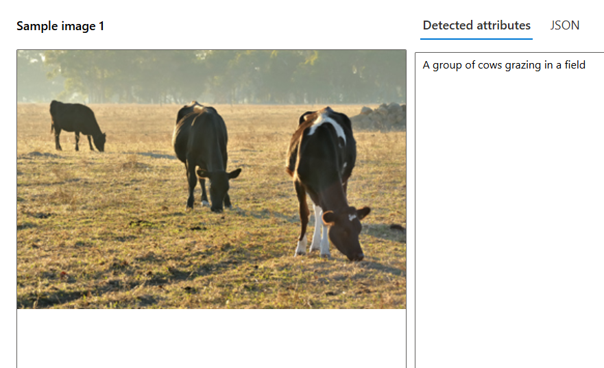
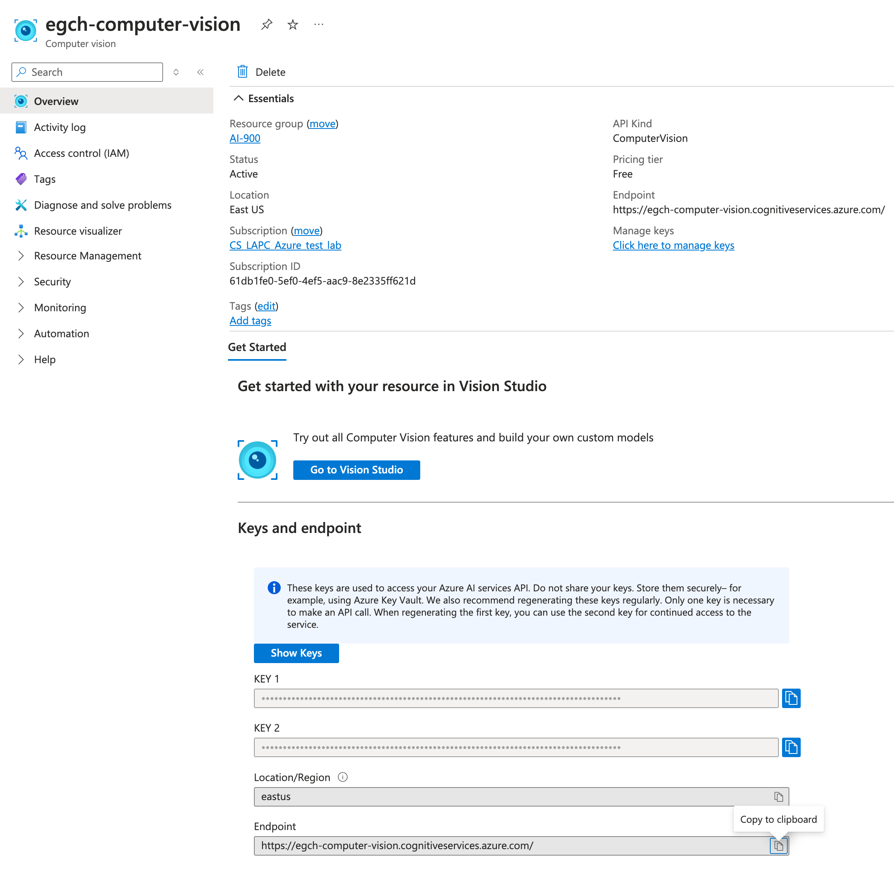
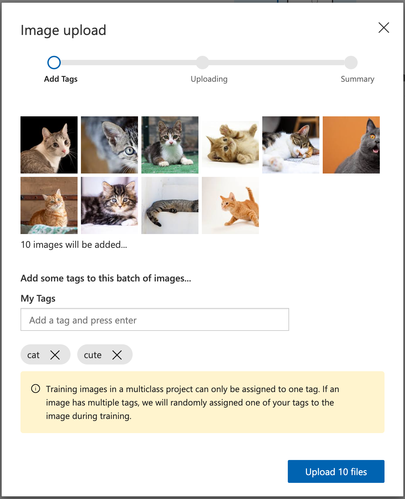
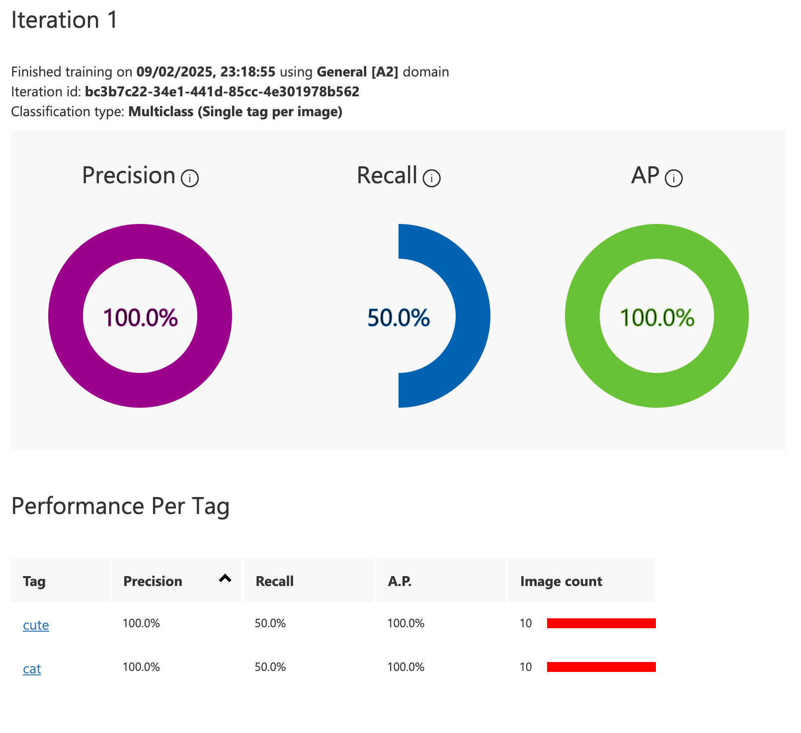
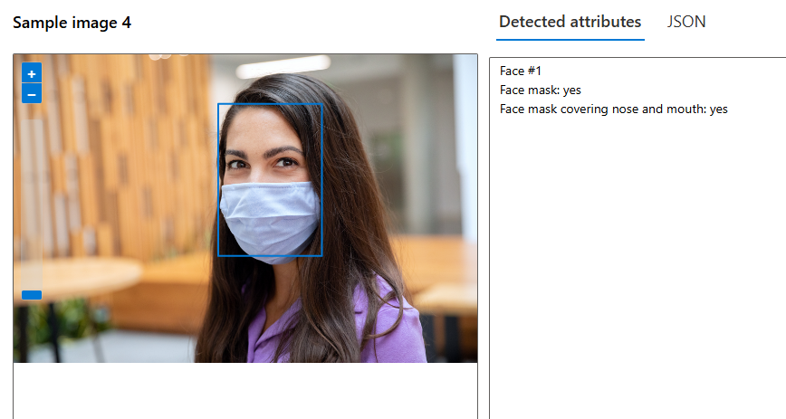
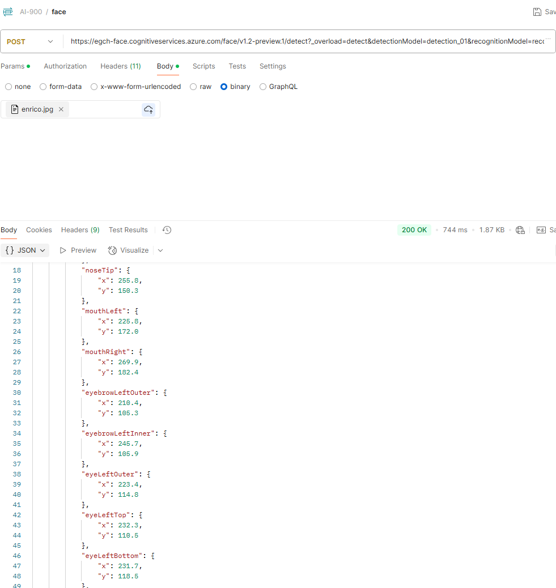
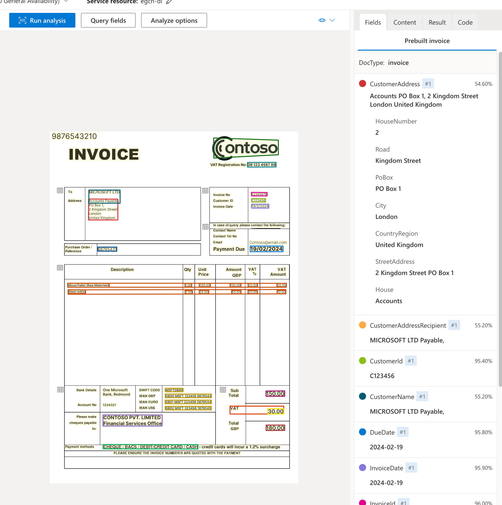
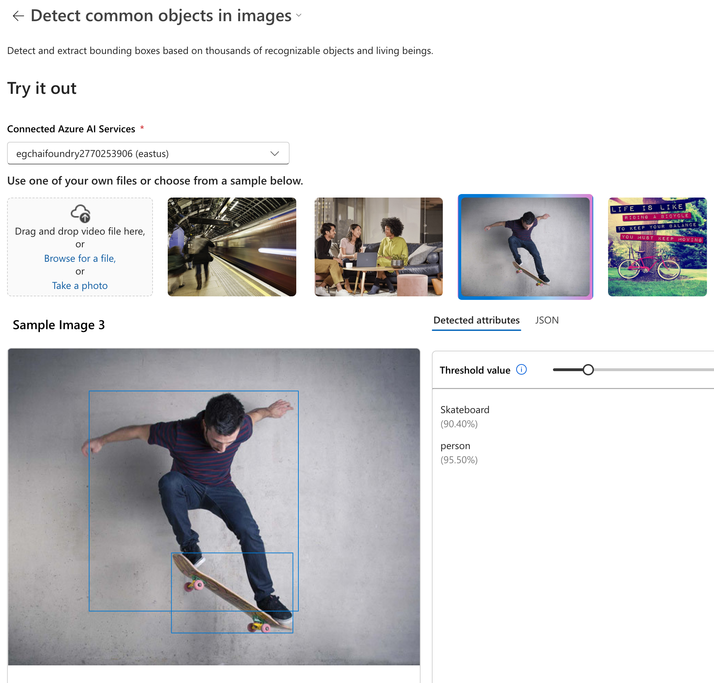

# section 4 - Describe features of computer vision workloads on Azure
Azure Computer Vision

## ComputerVision
From Marketplace create Computer Vision resource.

https://learn.microsoft.com/en-us/azure/ai-services/computer-vision/overview
### Create Computer Vision
    

The click on **Go to Vision Studio**.   
Alternative we can use _Azure AI Foundry_.

Behind the scenes, Visual Studio calls the Azure AI Vision service.

### Extract common tags from images
Image Analysis / Extract common tags from images

For each tag it provides a confidence code (0-100%).

We can also see the json contents.

### Add captions to images
Image Analysis / Add captions to images

### Object Detection
Image Analysis / Detect common objects in images

Note the bounded rectangle on the images.

#### Json

### Extract text from images
Optical character recognition / Extract text from images.

## API Vision Service

[docs](https://learn.microsoft.com/en-us/rest/api/computervision/image-analysis/analyze-image?view=rest-computervision-v4.0-preview%20(2023-04-01)&tabs=HTTP)

### Analyze Image

### POST
URL: https://egch-vision.cognitiveservices.azure.com/computervision/imageanalysis:analyze?api-version=2023-04-01-preview&features=tags

In the Body, change the type to binary, then upload a file.

#### Headers
- **Ocp-Apim-Subscription-Key**: corresponding to the key of `computervision` in Azure
- **Content-Type**: application/octet-stream

### Response

## Custom Vision
Create from Azure Marketplace.
https://www.customvision.ai/
### Project Cats recognition

- add
- train
- quick train

Quick test (tiger)

## Azure AI Face service
https://learn.microsoft.com/en-us/azure/ai-services/computer-vision/overview-identity

Create Face from the marketplace.
## AI Face service
- Marketplace create Face
- Vision Studio / Face / Detect faces in an image

### Face detection via postman
https://learn.microsoft.com/en-us/rest/api/face/face-detection-operations/detect?view=rest-face-v1.2-preview.1&tabs=HTTP

## Document Intelligence
[Document Intelligence Studio](https://documentintelligence.ai.azure.com/studio/)
### Invoices
Studio / Invoices

## Azure AI Foundry
[Azure AI Foundry docs](https://learn.microsoft.com/en-us/azure/ai-studio/what-is-ai-studio)

- MarketPlace / Azure AI Foundry

- Launch Azure AI Foundry

- Create Project

### Project - Common image detection
AI Services / Vision + Document / Image / Common image detection

From here we have the same interfaces seen with Visual Studio.

  
### Project - Invoices
AI Services / Vision + Document / Document / Invoices
## Links
[Azure Portal Vision Cognitive](https://portal.vision.cognitive.azure.com/gallery/featured)

---
[Home](README.md)