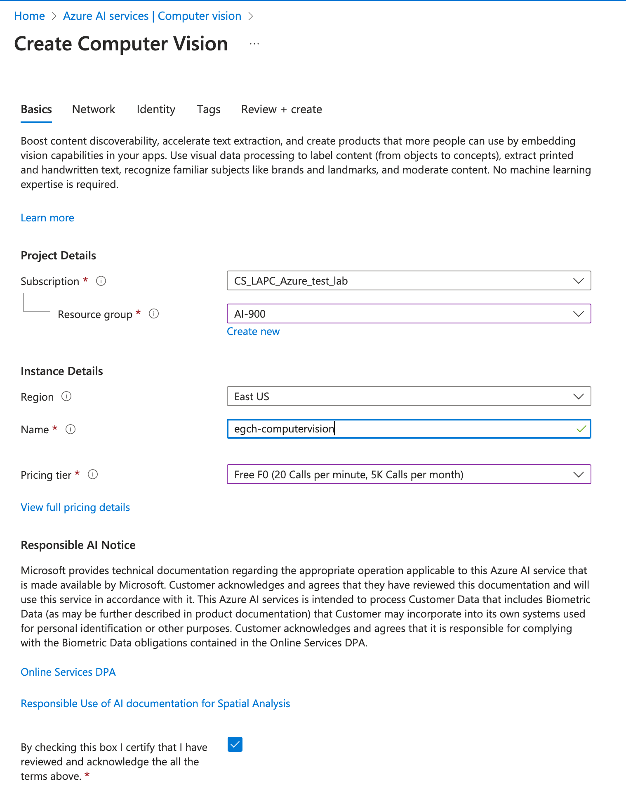
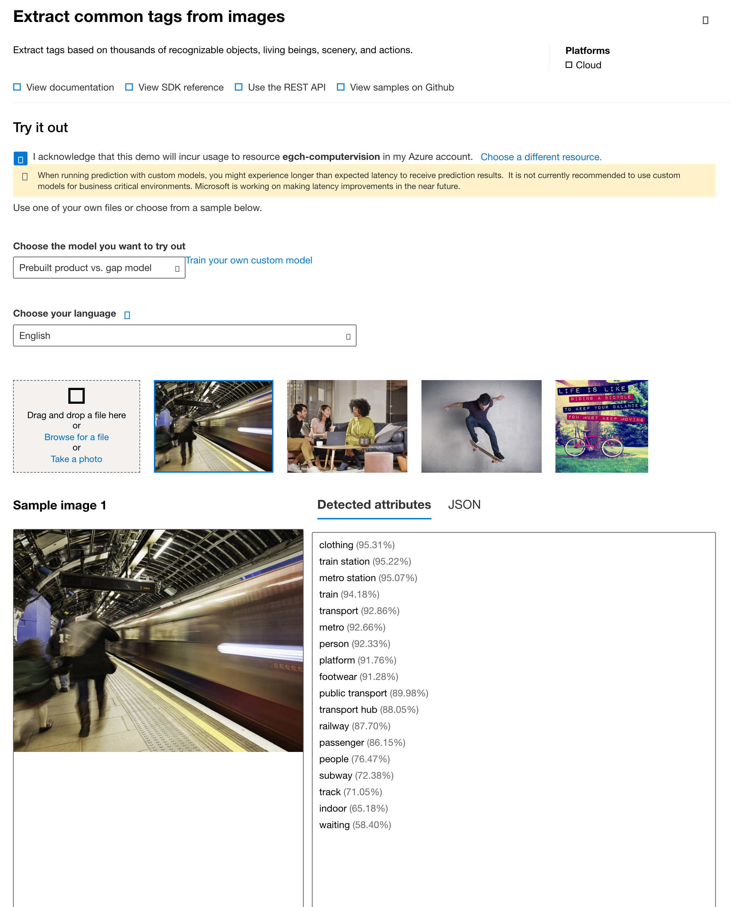
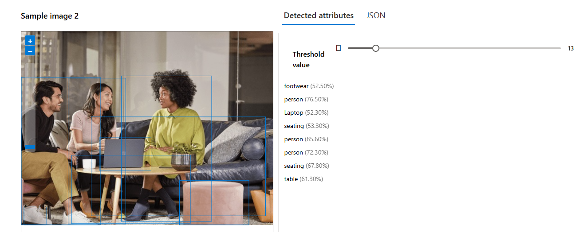
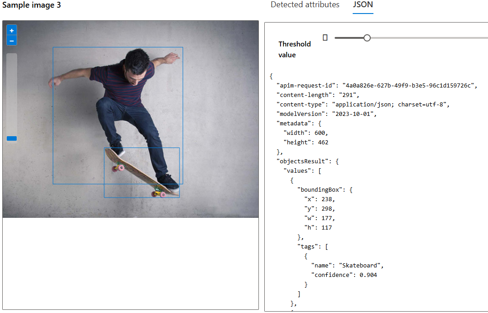
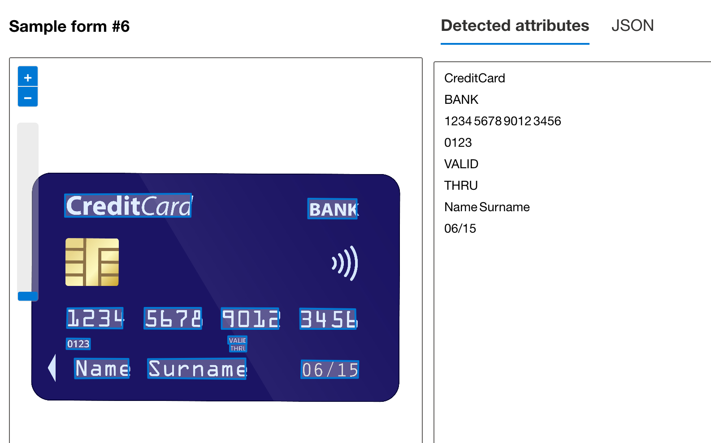

# section 4 - Describe features of computer vision workloads on Azure
Azure Computer Vision

## ComputerVision
https://learn.microsoft.com/en-us/azure/ai-services/computer-vision/overview
### Create Computer Vision
    

Go to Vision Studio.

Behind the scenes, Visual Studio calls the Azure AI Vision service

### Extract common tags from images
Image Analysis / Extract common tags from images

### Add captions to images
Image Analysis / Add captions to images

### Object Detection
Image Analysis / Detect common objects in images

Note the bounded rectangle on the images.

#### Json

### Extract text from images
Optical character recognition / Extract text from images

## API Vision Service
[docs](https://learn.microsoft.com/en-us/rest/api/computervision/image-analysis/analyze-image?view=rest-computervision-v4.0-preview%20(2023-04-01)&tabs=HTTP)

### POST
https://egch-vision.cognitiveservices.azure.com/computervision/imageanalysis:analyze?api-version=2023-04-01-preview&features=tags

### Analyze Image

## Custom Vision
## AI Face service

## Document Intelligence
https://documentintelligence.ai.azure.com/studio/

## Azure AI Foundry
https://learn.microsoft.com/en-us/azure/ai-studio/what-is-ai-studio
## Links
[Azure Portal Vision Cognitive](https://portal.vision.cognitive.azure.com/gallery/featured)