# section 5 - Natural Language Processor (NLP)
> NLP (Natural Language Processing) is a field of computer science and artificial intelligence that focuses on enabling computers to understand, interpret, and generate human language in a way that's both meaningful and useful.
## Services
 - Key Phrase Extraction
 - Entity Recognition
 - Sentiment Analysis
 - Translation
 - Speech Recognition
 - Speech Synthesis

## Azure AI Language Service
 - Named Entity Recognition
 - Language Detection
 - Sentiment Analysis
 - Key phrase extraction
 - Custom question answering
  
### Create

 - Marketplace / Language service / Create
 - [Language Studio](https://language.cognitive.azure.com/)

### Key phrase extraction

Extract Information / Extract key phrases.

Original sentence: _"This hotel is a great place. The staff were friendly and helpful. The view of the sea was amazing."_

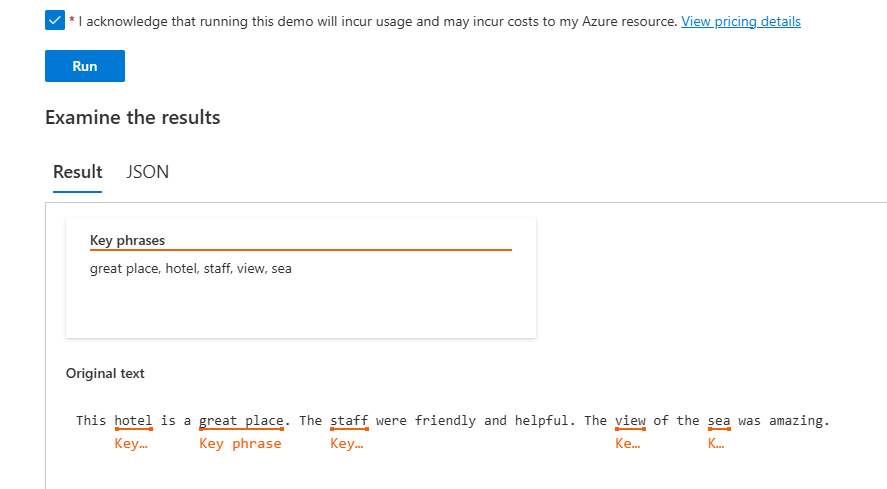

#### Postman
Headers:

1. Ocp-Apim-Subscription-Key
2. Content-Type - application/json

URL (POST): `https://egch-language2.cognitiveservices.azure.com/language/:analyze-text?api-version=2022-05-01`

 "kind": `KeyPhraseExtractionResults`

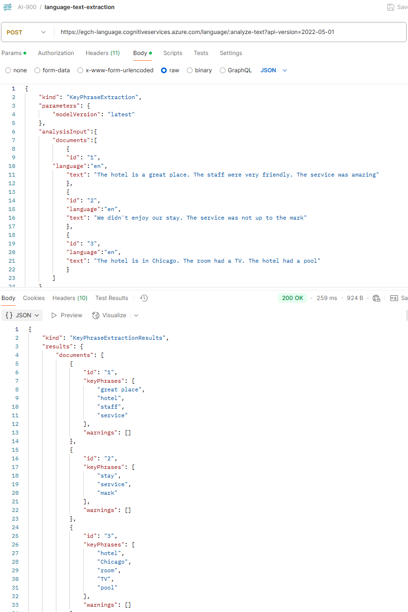

### Language Detection
Language Studio / Classify Text / Detect Language

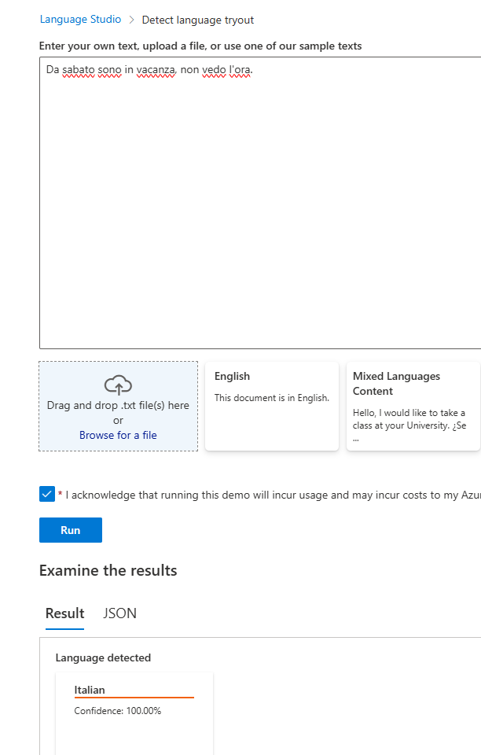

#### Postman

Same headers, url, body (almost) but this time the Kind is different.

 "kind": `LanguageDetection`

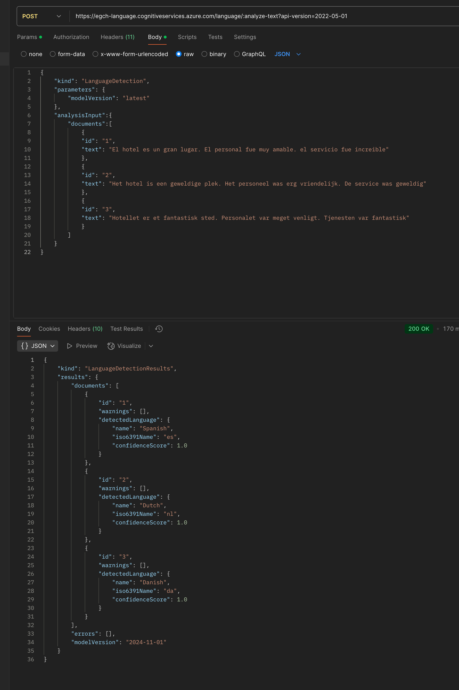

### Sentiment Analysis
Language Studio / Classify Text / Analyze sentiment and opinions

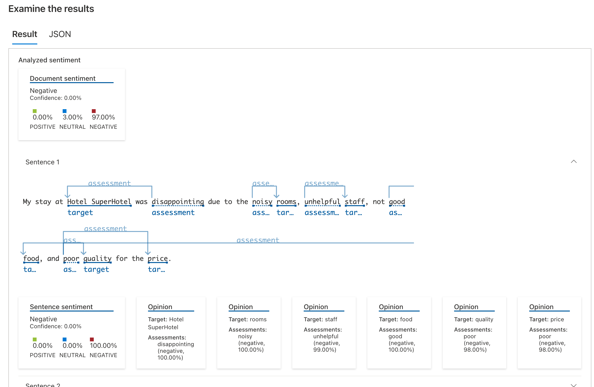

#### Postman
Same headers, url, body (almost) but this time the Kind is different.

 "kind": `SentimentAnalysis`

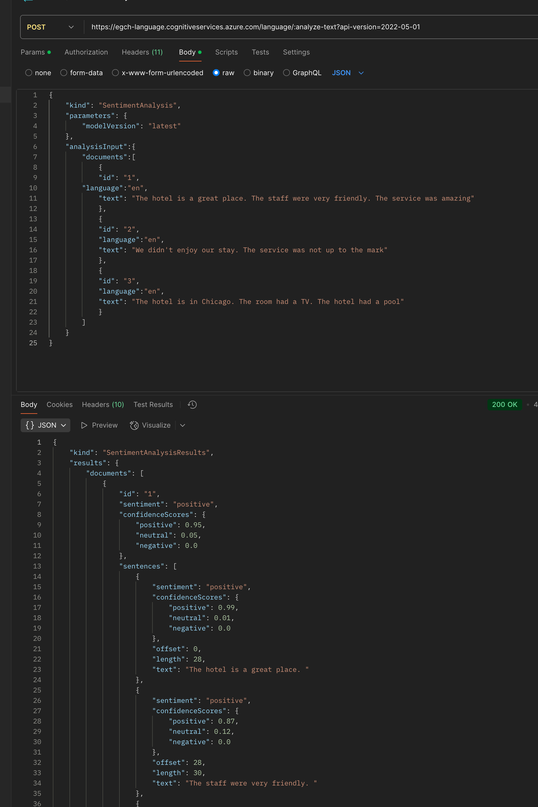

### Named Entity Recognition
Language Studio / Extract Information/ Extract named entities

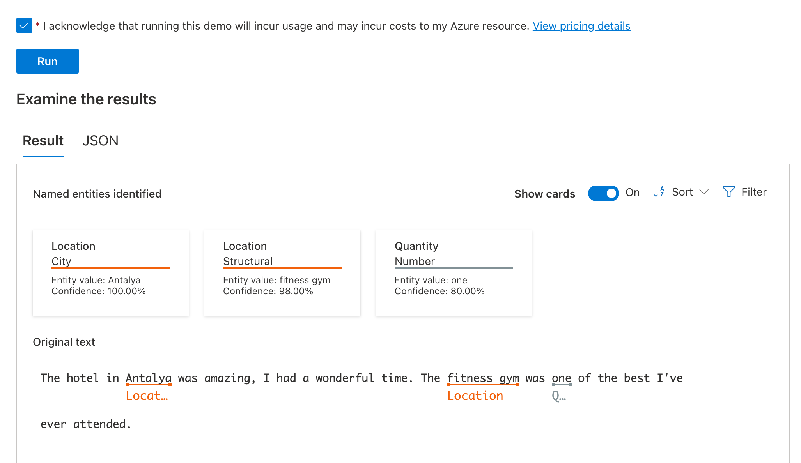

#### Postman
Same headers, url, body (almost) but this time the Kind is different.

 "kind": `EntityRecognition`

 [request](json/s5/NamedEntityRecognition_request.json)

 [response](json/s5/NamedEntityRecognition_response.json)
 
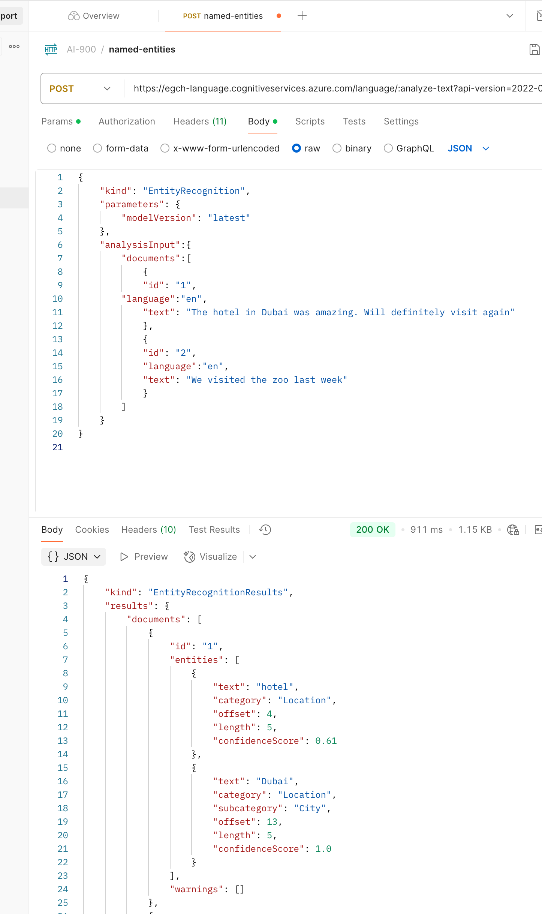

## Azure AI Translator
Marketplace / create Translator   
[docs translator](https://learn.microsoft.com/en-us/azure/ai-services/translator/reference/v3-0-reference)

#### Postman

Headers:
1. Ocp-Apim-Subscription-Key
2. Ocp-Apim-Subscription-Region: eastus

URL (POST): `https://api.cognitive.microsofttranslator.com/translate?api-version=3.0&from=en&to=it`

 [request](json/s5/translator_request.json)

 [response](json/s5/translator_response.json)

## Azure Speech
[What is the Speech service?](https://learn.microsoft.com/en-us/azure/ai-services/speech-service/overview)

Speech scenarios
 - captioning
 - convert speech to text
 - synthesize text to speech
 - translate speech

Marketplace / Speech / Create

Launch `Speech Studio`

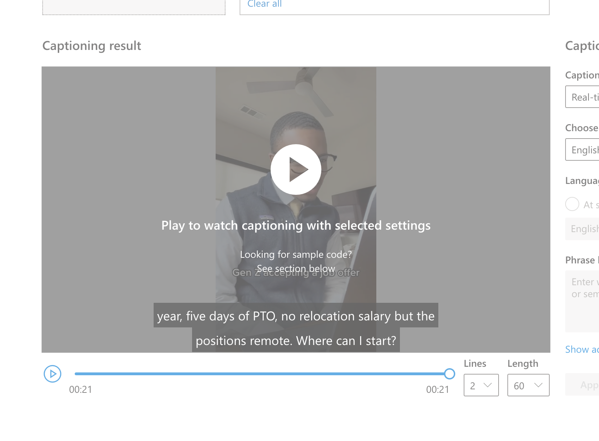

#### Postman
URL (POST):`https://eastus.stt.speech.microsoft.com/speech/recognition/conversation/cognitiveservices/v1?language=en-US&format=detailed`

Headers:
1. Ocp-Apim-Subscription-Key
2. Content-Type - audio/wav

### Text to Speech
Get the all possible voices available.
URL(GET): `https://eastus.tts.speech.microsoft.com/cognitiveservices/voices/list`

[list voices json](json/s5/speech_voices_available.json)

Now to produce the resulting audio:
URL(POST): `https://eastus.tts.speech.microsoft.com/cognitiveservices/v1`

Headers:
1. Ocp-Apim-Subscription-Key
2. Content-Type - application/ssml+xml
3. X-Microsoft-OutputFormat - audio-16khz-128kbitrate-mono-mp3

[request xml](xml/s5/request-test-to-speech.xml)

[response audio](audio/s5/text-to-speech.mp3)

## Azure AI Language
### Questions and Answers

### Using with Search Service
Marketplace / Azure AI Search / Create

Language Service / Resource Management / Features / pairing with search service.

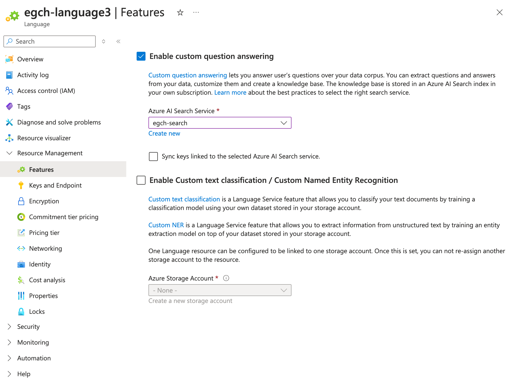

- Launch Language Studio / Understand questions and Conversational language / Custom question answering / Create new project.

- Edit knowledge base / Add question & answer (as many as you want)

- Deploy Knowledge Base / Prediction URL

#### Postman
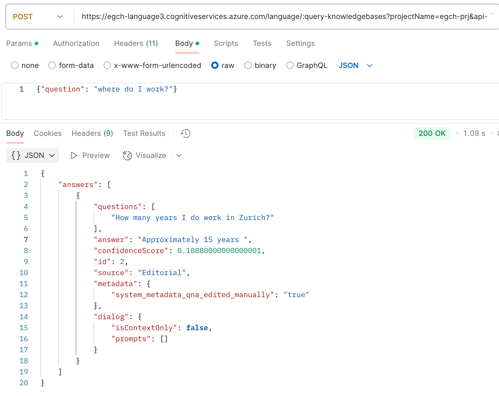

#### Importing from data sources
Language Studio / prj / add sources / Add chit chat

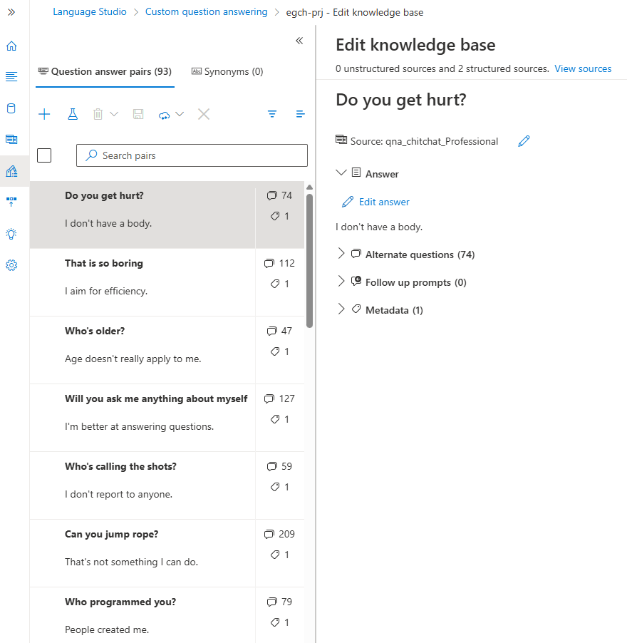

#### Creating a bot
- Language Studio/ prj/ Deploy knowledge base/ create a bot
- Link the boot to the key of your Azure language instance.

---
[Home](README.md)
