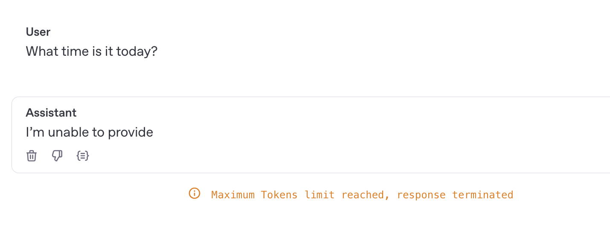
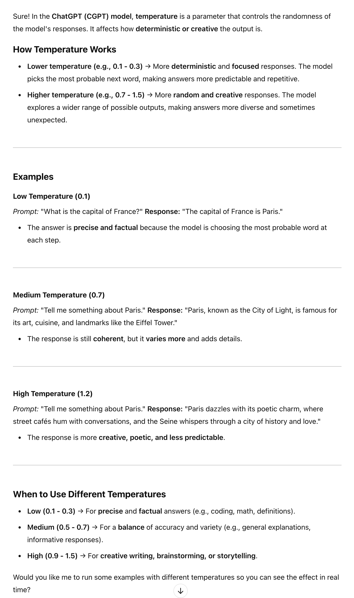

# section 6 - Generative AI workloads for Azure
## Large Language Models - LLM
### Chat GPT
### Github Copilot
## OpenAI platform
[OpenAI developer platform](https://platform.openai.com/docs/overview)

### Signup
### Tokens
[Tokenizer](https://platform.openai.com/tokenizer)

When it's down to costs you need to consider the total number of tokens both input and output.

#### Parameters
_Max tokens_

_Temperature_

## GPT - System Messages

## GPT - Using the audio feature

<audio controls>
  <source src="audio/chat-playground-audio.wav" type="audio/wav">
  Your browser does not support the audio element.
</audio>

## Azure OpenAI service
Create Azure AI Foundry from the marketplace.

[Azure OpenaAI service](https://learn.microsoft.com/en-us/azure/ai-services/)

openai/overview

Go to Azure AI Foundry portal